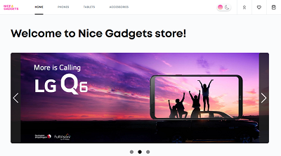

#  Nice Gadgets Project

# Preview

## Front-end:

## [vercel page](https://nice-gadgets-fe.vercel.app/) | [repository](https://github.com/fe-may23-bugs-and-hugs/nice-gadgets-fe)

- ### Technologies used:
- #### React - https://react.dev/
- #### TypeScript - https://www.typescriptlang.org/
- #### React-router-dom - https://reactrouter.com/
- #### Axios - https://axios-http.com/
- #### Swiper - https://swiperjs.com/
- #### Styled-components - https://styled-components.com/
- #### React-content-loader - https://skeletonreact.com/ | https://www.npmjs.com/package/react-content-loader
- #### React-hook-form - https://react-hook-form.com/ | https://www.npmjs.com/package/react-hook-form
- #### React-loader-spinner - https://mhnpd.github.io/react-loader-spinner/ | https://www.npmjs.com/package/react-loader-spinner
- #### React-paginate - https://www.npmjs.com/package/react-paginate

## Back-end:

## [render server](https://nice-gadgets-be.onrender.com) | [repository](https://github.com/fe-may23-bugs-and-hugs/nice-gadgets-be)

- ### Technologies used:
- #### NodeJS - https://nodejs.org/en/docs
- #### TypeScript - https://www.typescriptlang.org/
- #### Express - https://expressjs.com/
- #### Mongoose - https://mongoosejs.com/
- #### Cors - https://www.npmjs.com/package/cors
- #### bcrypt - https://www.npmjs.com/package/bcrypt
- #### jsonwebtoken - https://www.npmjs.com/package/jsonwebtoken
